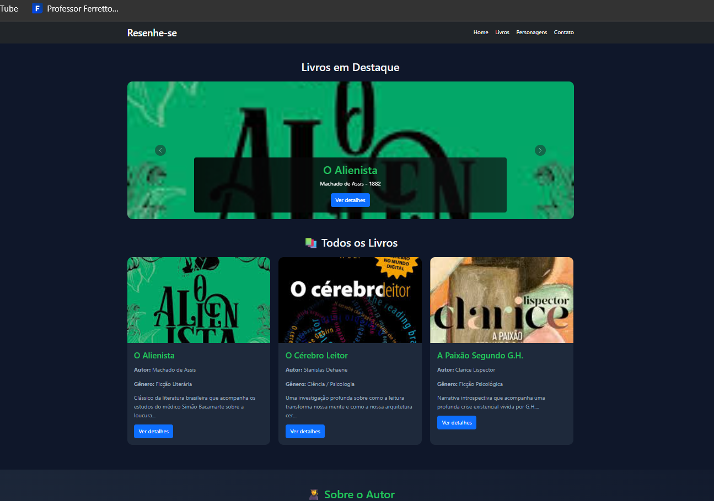

# Trabalho Prático - Semana 11

Nesta atividade, vamos evoluir o projeto em que estamos trabalhando nesse semestre, acrescentando a página de detalhes.

Imagine que a página principal (home-page) mostre um visão dos vários itens que existem no seu site. Ao clicar em um item, você é direcionado pra a página de detalhes. A página de detalhe vai mostrar todas as informações sobre o item do seu projeto, seja esse item uma notícia, filme, receita, lugar turístico ou evento.

## Informações Gerais

- Nome: Luiz Gustavo Campos Andrade
- Matricula: 928390 
- Decreva brevemente seu projeto: 

## Prints do trabalho

<<  COLOQUE A IMAGEM - HOME-PAGE - AQUI >>


<<  COLOQUE A IMAGEM - TELA DE DETALHES - AQUI >>


## Dados em JSON
Inclua aqui a estrutura de dados definida por você para o projeto com pelo menos dois exemplo de dados.

```json
{
            id: 1,
            nome: "O Alienista",
            autor: "Machado de Assis",
            genero: "Ficção Literária",
            ano: 1882,
            paginas: 96,
            destaque: true,
            imagem: "../images/oalienista.jpg",
            descricao: "Clássico da literatura brasileira que acompanha os estudos do médico Simão Bacamarte sobre a loucura na cidade de Itaguaí.",
            personagens: [
                { nome: "Simão Bacamarte", imagem: "../images/oalienista.jpg" },
                { nome: "Dona Evarista", imagem: "../images/oalienista.jpg" },
                { nome: "Padre Lopes", imagem: "../images/oalienista.jpg" }
            ]
        },
        {
            id: 2,
            nome: "O Cérebro Leitor",
            autor: "Stanislas Dehaene",
            genero: "Ciência / Psicologia",
            ano: 2007,
            paginas: 396,
            destaque: true,
            imagem: "../images/ocerebroleitor.jpg",
            descricao: "Uma investigação profunda sobre como a leitura transforma nossa mente e como a nossa arquitetura cerebral se adapta à palavra escrita.",
            personagens: [
                { nome: "Córtex Visual", imagem: "../images/ocerebroleitor.jpg" },
                { nome: "Neurônios de Leitura", imagem: "../images/ocerebroleitor.jpg" }
            ]
        }
```


